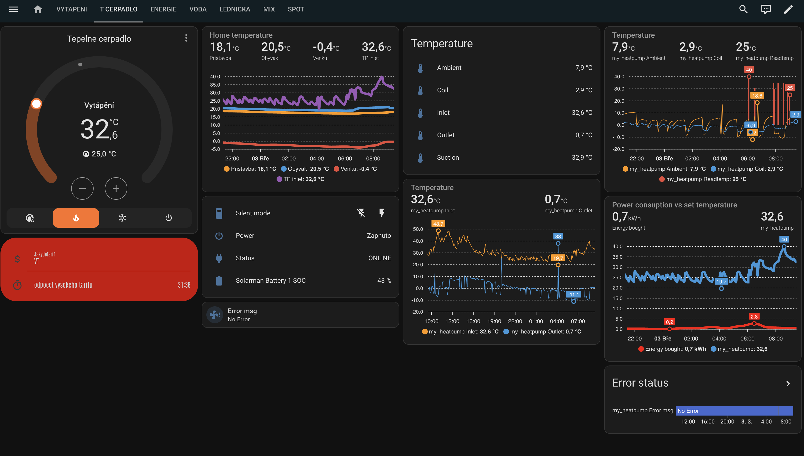

# aquatemp

Bash scripts for integration of AquaTemp wifi module to Home Assistant using mqtt autodiscovery

requirement of mosquitto_pub and mosquitto_sub and jq
(mosquitto-clients jq)

first run

1.	edit settings file for your needs
2.	./heatpump install
3. ~~add control.sh and status.sh to systemd
	(you could use the script "setup_systemd install" to add and enable the service "ubuntu"
	the service name will be aquatemp_control and aquatemp_status)~~

uninstall

1.	./heatpump uninstall (removes the entities from Home Assistant)
2.	remove control.sh and status.sh from systemd
	~~(you could use the script "setup_systemd uninstall" to remove and disable the service "ubuntu")~~


Poll intervall for the app is 20s, so i recommend to not set this to lower value than 20s 

# Warmlink update
- API calls from iOS app wireshark data, object camelcased, different auth URI, ...
- run in term/ssh on HASS (need to be rerun if restarted)
    ```shell
	 nohup ./status.sh &
	 nohup ./control.sh &
	```
  - status.sh read data from cloud and store them in MQTT, calling heatpump script
  - control.sh read MQTT and change temp/mode when changed, calling heatpump script with specific commands

## TODO
- DWH temp read works, but it's not propageted to MQTT (I don't see any values) - so far no idea why and of course missing setup of DWH temp
- Sanitation period, from time to time HP set 50C+ temperature to clean up, but it usually hits high power tarrif - need to be able to set it out in HA based on tarifs
- Some parameters doesn't exists, there are others which are not covered yet
 - ~~No idea about password hash mechanism yes - hash taken from wireshark and use as a password in settings~~
	- ```echo -n "YOURPASSWORD" | openssl dgst -md5 | awk '{print $2}'```
- ~~Changing temperature via shell script - see `HASS_script_only.md`~~
- ~~Busybox grep is not working properly/not GNU~~
  - replaced by perl regexp
  


# Automation based on EGD power tarif
- NT/VT

## Show in dashboard
```shell
type: entities
entities:
  - entity: input_text.jakyjetarif
    secondary_info: none
    icon: mdi:currency-usd
  - entity: timer.odpocet_vysokeho_tarifu
state_color: false
visibility:
  - condition: state
    entity: input_text.jakyjetarif
    state: VT
theme: LCARS 25C (Red Alert)
```


## NT
```bash
alias: HDO tarify - NT
description: ""
triggers:
  - trigger: time
    at: "00:00:00"
  - trigger: time
    at: "10:00:00"
  - trigger: time
    at: "13:00:00"
  - trigger: time
    at: "17:00:00"
  - trigger: time
    at: "21:00:00"
actions:
  - action: input_text.set_value
    metadata: {}
    data:
      value: NT
    target:
      entity_id: input_text.jakyjetarif
  - action: climate.set_temperature
    metadata: {}
    data:
      temperature: 35
    target:
      entity_id: climate.my_heatpump
mode: single
variables:
  tariff: NT
```

## VT
```bash
alias: HDO tarify - VT
description: ""
triggers:
  - trigger: time
    at: "9:00:00"
  - trigger: time
    at: "12:00:00"
  - trigger: time
    at: "16:00:00"
  - trigger: time
    at: "20:00:00"
conditions: []
actions:
  - action: input_text.set_value
    metadata: {}
    data:
      value: VT
    target:
      entity_id: input_text.jakyjetarif
  - action: timer.start
    metadata: {}
    data:
      duration: "1:0:0"
    target:
      entity_id: timer.odpocet_vysokeho_tarifu
  - action: climate.set_temperature
    metadata: {}
    data:
      temperature: 25
    target:
      entity_id: climate.my_heatpump
mode: single
variables:
  tariff: VT
```
